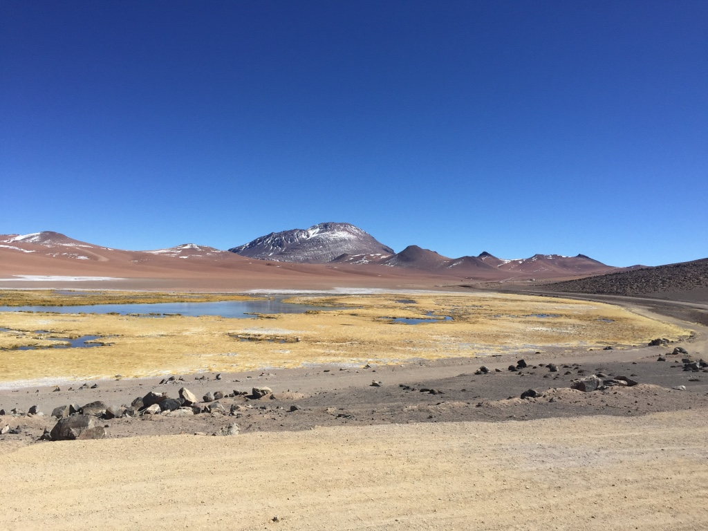
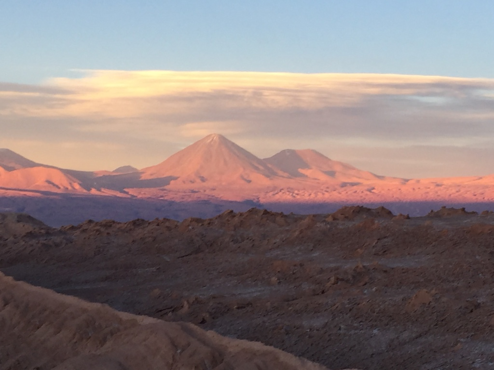
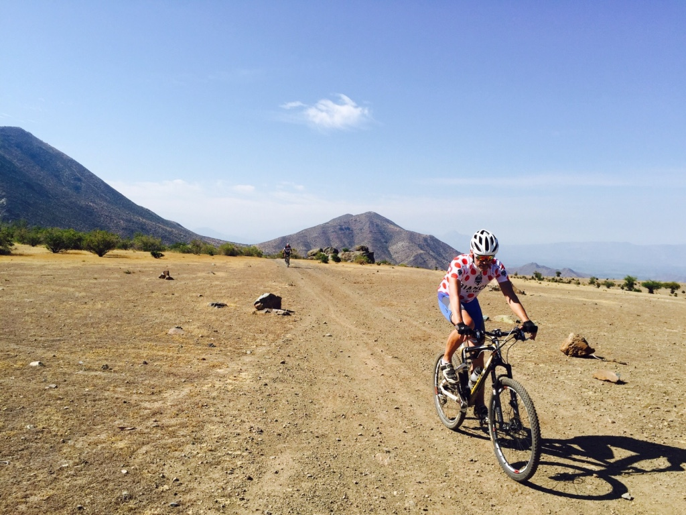
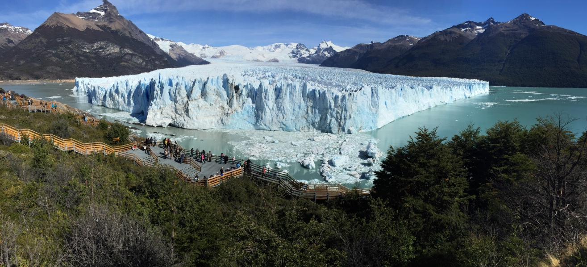

This is my third post on my new blog! How exciting!

I'm sure I'll write a lot more interesting things in the future.

Let´s start.

Living in Chile I had the oportunity to visit wonderful places, one the more amazing
places was Atacama desert.
[San Pedro de Atacama](https://en.wikipedia.org/wiki/San_Pedro_de_Atacama).

> Cycling around San Pedro de Atacama in north Chile we reached the Bolivian 
> border, we found a exausted cyclist, after taking a break and eating something,
> he started to tell us his long journey to arrive there, he crossed all of Chile
> from Argentine Patagonia just with €100. Many people helped him giving food 
> and drinks. His goal was to get Costa Rica in one month time. Good luck my 
> friend!!!!

## Chile-Bolivia border

Bolivia border

## Valle del infierno

Valle del infierno

## Los Andes

Los Andes mountains

Spectacular natural environment

    Every step you take is a surprise, the vastness overwhelms. 
    The sky at night is clear and feel that the stars are within 
    your reach.

## La Patagonia, the opposite pole 

Perito Moreno 

This is [Patagonia clilena](https://en.wikipedia.org/wiki/Patagonia "Example") link.

