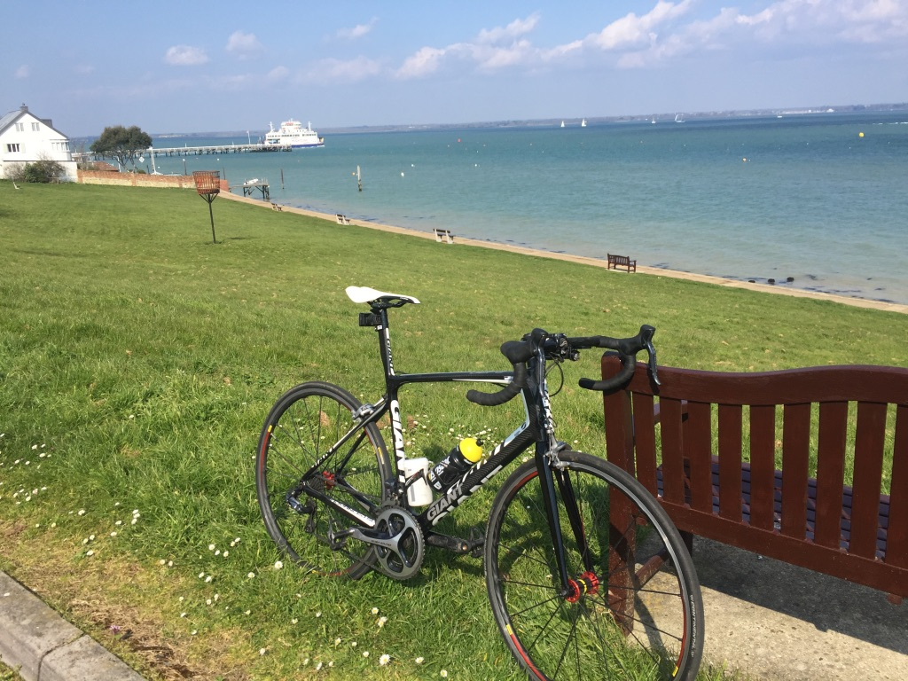

This is my first post on my new blog! How exciting!

I'm sure I'll write a lot more interesting things in the future.

Let´s start.

Living in England,I have traveled much of southern England, among the highlights was the Isle of Wight and in countryside. 
([Wikipedia Link]https://en.wikipedia.org/wiki/Isle_of_Wight))

> Cycling around England is strange at the begining, because after cycling in the 
> inmmensity of Chile which almost there is traffic, in England you have to get 
> used to cycling with cars around you all the time. 
> I discovered a little island in south England. In the Isle of Wight the traffic 
> is totally different, there are no many cars and you can go cycling free.

## Isle of Wight

Yarmouth

## Countryside 

