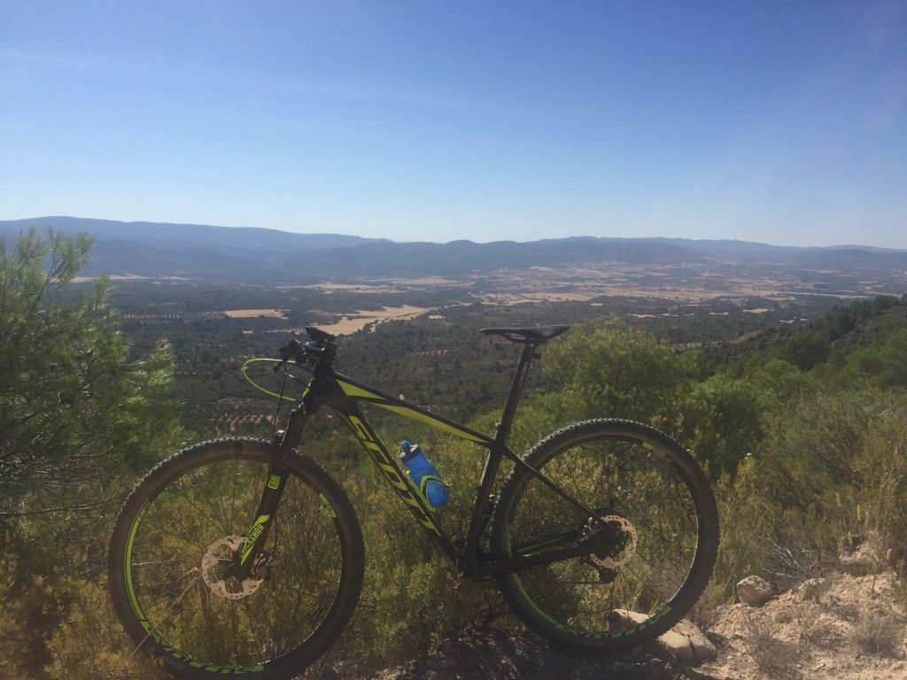
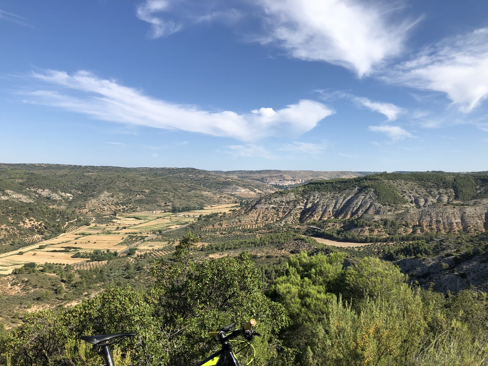
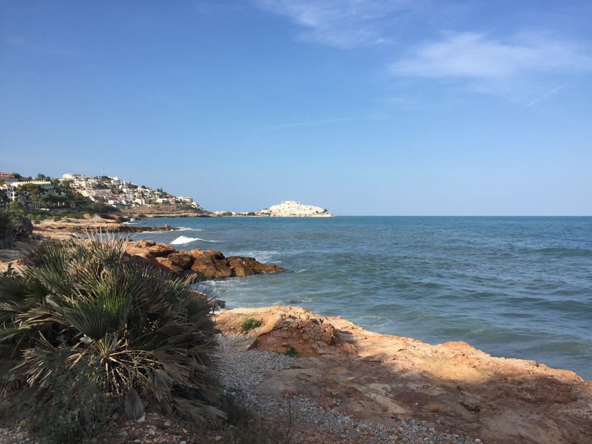

This is my second post on my new blog! How exciting!

Let´s start.

Living in Guadalajara, you always have many possibilities of cycling, climbing the montains, cycling around the lakes, seeing old villages and amazing nature.
([Wikipedia Link]https://es.wikipedia.org/wiki/Guadalajara_(España))

> Cycling at home is always the best pleasure, your land, your people
> the incredible places to go to cycling, the fresh air, the contrasts 
> of colors, I will come back to stay.

## Alcarria

Alcarria

([Wikipedia Link]https://en.wikipedia.org/wiki/La_Alcarria)

## Pastrana

Pastrana

([Pastrana Link]http://www.pastrana.org/turismo/)

## Costa de Castellón

Peñiscola